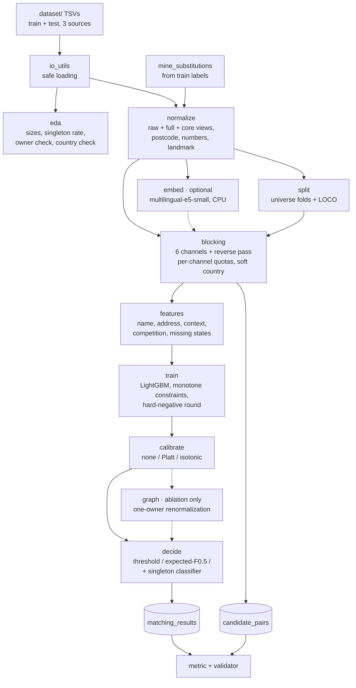
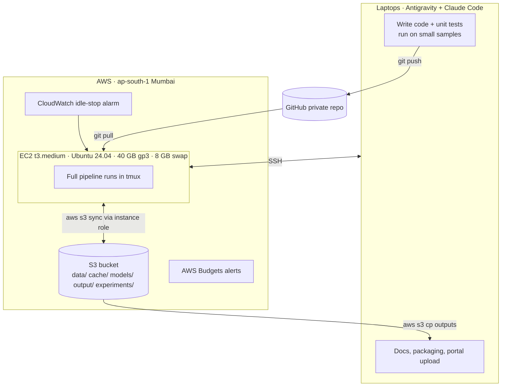

# Business Entity Resolution — Implementation Guide (v2, CPU edition)

**Amazon ML Challenge 2026 · Combined solution + AWS runbook**

This document is the single source of truth for building the solution. It merges the two earlier designs (the "metric-aware" plan and the "structured baseline" plan) and incorporates the risk review. It is written for two readers:

- **Humans on the team** — to understand the approach, run AWS, and make decisions.
- **Claude Code** — as implementation context. Every module has a spec with inputs, outputs, function signatures, and acceptance tests. Section 18 contains a ready-to-use `CLAUDE.md`, and Section 11 contains phase-by-phase prompts.

**Hard constraints of this edition**

- **CPU only.** Default instance: `t3.medium` (2 vCPU, 4 GiB RAM). Everything must fit in ~3 GB of working memory.
- **Budget: $100 of AWS credits.** The plan below should cost well under $20.
- **No GPU stages by default.** The cross-encoder and LLM from v1 are out of scope; an optional CPU embedding channel remains.

---

## Table of contents

**Part A — Solution**
1. [Problem summary](#1-problem-summary)
2. [What changed from v1](#2-what-changed-from-v1)
3. [Architecture](#3-architecture)
4. [Component switches](#4-component-switches)
5. [Repository layout](#5-repository-layout)
6. [Module specifications](#6-module-specifications)
7. [Validation protocol](#7-validation-protocol)
8. [Final training and test inference](#8-final-training-and-test-inference)
9. [Experiment plan and ablations](#9-experiment-plan-and-ablations)
10. [Memory and performance rules for t3.medium](#10-memory-and-performance-rules-for-t3medium)
11. [Build order with Claude Code prompts](#11-build-order-with-claude-code-prompts)

**Part B — AWS**
12. [AWS architecture and cost plan](#12-aws-architecture-and-cost-plan)
13. [Step-by-step AWS setup](#13-step-by-step-aws-setup)
14. [Daily operations](#14-daily-operations)
15. [Troubleshooting](#15-troubleshooting)
16. [Teardown](#16-teardown)

**Part C — Delivery**
17. [Timeline, roles, submission checklist, rules](#17-timeline-roles-submission-checklist-rules)
18. [Appendix: CLAUDE.md, requirements, config, reference code](#18-appendix)

---

# Part A — Solution

## 1. Problem summary

**Data.** Three sources of business records, each with `entity_id`, `business_name`, `business_address`, `country`. The ID prefix (`S1-`, `S2-`, `S3-`) gives the source.

- **Source 1** is the deduplicated reference list.
- **Sources 2 and 3** are noisy feeds with no shared identifier.
- Training covers **US and India**; the test set adds **France**. Country is an open set of labels — never hard-code `{US, India}`.

**Task.** For every Source 1 entity, output the IDs of all S2/S3 records describing the same business. The answer can be several IDs, one, or none.

**Metric.** F0.5 per Source 1 entity, macro-averaged over all entities:

```
F_0.5 = (1.25 × P × R) / (0.25 × P + R)   ≡   1.25·TP / (0.25·|truth| + |prediction|)
```

| Truth for one entity | Prediction | Score |
|---|---|---|
| 0 matches (singleton) | empty | **1.00** |
| 0 matches | anything | 0.00 |
| 1 match | the match | 1.00 |
| 1 match | the match + 1 wrong | 0.56 |
| 1 match | empty | 0.00 |
| 2 matches | 1 of 2 | 0.83 |
| 2 matches | both + 1 wrong | 0.71 |

**Design consequences**

1. Every entity counts equally; correct singletons are worth as much as perfect clusters.
2. With several true matches, a false addition costs more than a miss.
3. For a single candidate with calibrated probability *p*, predicting it earns *p* and predicting nothing earns *1 − p*, so the break-even is 0.5. Precision weighting matters only when candidates compete.
4. Therefore the decision rule should be chosen by validation among a global threshold and a per-entity expected-F0.5 decoder.

**Outputs.** Two tab-separated files:

- `output/matching_results.tsv` — `source1_entity_id`, `matched_entity_ids` (scored).
- `output/candidate_pairs.tsv` — `source1_entity_id`, `candidate_entity_ids` (the exact set the model scored; not scored, but audited).

Every matched ID must appear in the candidate list. One row per test S1 entity; empty string for no matches; no duplicates; only S2/S3 IDs that exist in the test set.

---

## 2. What changed from v1

| Topic | v1 plan | v2 decision | Reason |
|---|---|---|---|
| Compute | EC2 g5.xlarge GPU | EC2 t3.medium CPU | Budget and simplicity |
| Cross-encoder (mDeBERTa) | Core | **Removed** (optional GPU appendix only) | Not feasible on 2 vCPUs |
| LLM tie-breaker | Optional | **Removed** | Cost, risk, low expected value |
| Embedding channel | multilingual-e5-base on GPU | **Optional**, `multilingual-e5-small` on CPU | Helps France; must earn its place |
| Blocking cap | One combined score, global top-K | **Per-channel quotas**, then optional cap | Protects matches found by only one channel |
| Country in blocking | Hard filter if EDA allows | **Soft**: same-country preferred, missing = neutral, small cross-country quota | Robust to noisy country labels |
| One-owner constraint | Assumed | **Verified in EDA**; renormalization is an ablation only | Not guaranteed by the problem statement |
| Renormalization | Core | **Off by default** | Double-counts competition features |
| Transitive S2↔S3 support | Core | **Removed** | False merges propagate |
| Pseudo-labeling on test | Optional | **Off** unless organizers confirm | Rules wording + confirmation bias |
| TF-IDF fitting | Train + test | **Train only** by default (config flag) | Rules wording; validation must mirror test protocol |
| Decision layer | Expected-F0.5 decoder | **Chosen by CV** among: global threshold, decoder, decoder + singleton classifier | Decoder assumes independence |
| Calibration | Isotonic | **Chosen by CV** among: none, Platt, isotonic | Isotonic can overfit |
| Missing components | Postcode 3-state | **Every component** has an explicit missing state | Missing ≠ different |
| Hard negatives | Fixed 4:1 | All candidates if memory allows; else subsample + one mining round | Tuned, not assumed |
| Noise mining | Rules from label alignment | Kept; **ambiguous substitutions become features/keys**, only reviewed ones become rewrites | Avoid over-merging |
| S2 vs S3 | Source flag | Source flag + **measure** differences; separate models only if validated | From baseline plan |
| Experiment tracking | Ablation table | **CSV experiment log** + submission history | From baseline plan |

---

## 3. Architecture

### 3.1 Pipeline



### 3.2 Where things run



**Division of labour**

- **Laptops** (with Claude Code in Antigravity): write code, run unit tests, and run the pipeline on a small sample (`--sample 0.05`). Your laptop is probably faster than a t3.medium for short runs; that is fine.
- **EC2 t3.medium**: full-data runs, cross-validation, ablations, and test inference — long jobs that must survive laptop sleep and be reproducible for the whole team.
- **S3**: shared storage for the dataset, cached artifacts, trained models, outputs, and the experiment log. The instance reads and writes it through an IAM role, so no AWS keys live on the instance.
- **GitHub**: the only way code moves. Never edit code directly on the instance except for emergencies.

### 3.3 Data flow between modules

| Module | Reads | Writes |
|---|---|---|
| `io_utils` | `dataset/{train,test}/*.tsv` | DataFrames |
| `eda` | train + test records, ground truth | `reports/eda.md`, `reports/eda.json` |
| `mine_substitutions` | train records + ground truth | `dictionaries/mined_candidates.tsv` (for manual review) |
| `normalize` | raw records, dictionaries | `cache/records_norm.parquet` |
| `split` | normalized train records + ground truth | `cache/folds.parquet` |
| `embed` (optional) | `records_norm.parquet` | `cache/emb_e5s.npy` |
| `blocking` | normalized records, folds, (embeddings) | `cache/candidates_{universe}.parquet`, `reports/blocking.md` |
| `features` | candidates, normalized records | `cache/features_{universe}.parquet` |
| `train` | features + labels | `models/lgbm_fold{k}.txt`, `models/lgbm_final.txt`, `cache/oof.parquet` |
| `calibrate` | OOF predictions | `models/calibrator.pkl` |
| `decide` | calibrated probabilities | `cache/decisions.parquet`, `models/decision_config.json` |
| `graph` (ablation) | calibrated probabilities | adjusted probabilities |
| `evaluate` | everything above in CV mode | `experiments/log.csv`, `reports/cv_*.md` |
| `predict` | test universe | `output/matching_results.tsv`, `output/candidate_pairs.tsv` |

---

## 4. Component switches

All switches live in `configs/default.yaml` (full file in the appendix). Each experiment toggles exactly one switch against the current best configuration.

| Switch | Default | Status | Notes |
|---|---|---|---|
| `normalize.use_mined_rewrites` | `true` | Core | Only manually reviewed rules |
| `blocking.channels` | `[exact, rare_token, name_tfidf, addr_tfidf, postcode_prefix, acronym]` | Core | Add `embedding` if enabled |
| `blocking.reverse_pass` | `true` | Core | |
| `blocking.country_mode` | `soft` | Core | `soft` \| `none` |
| `blocking.final_cap` | `null` | Core | Set only if memory requires |
| `vectorizer.fit_on` | `train` | Core | `train` \| `train_test` — see Section 17.4 |
| `features.competition` | `true` | Core | |
| `train.negatives` | `all` | Core | `all` \| `subsample` |
| `train.hard_negative_round` | `false` | Experiment | Only meaningful with `subsample` |
| `calibration.method` | chosen by CV | Experiment | `none` \| `platt` \| `isotonic` |
| `decision.method` | chosen by CV | Experiment | `threshold` \| `expected_f` \| `expected_f_singleton` |
| `embedding.enabled` | `false` | Phase 2 | CPU `multilingual-e5-small` |
| `graph.renormalize` | `false` | Ablation | Only if EDA shows max owners = 1 |
| `pseudo_label.enabled` | `false` | Off | Rules question |
| `transitive.enabled` | — | Removed | Not implemented |

---

## 5. Repository layout

```
business_entity_resolution/
├── CLAUDE.md                    # context file for Claude Code (Section 18.1)
├── README.md                    # exact reproduction steps (required by the challenge)
├── requirements.txt             # pinned versions
├── Makefile                     # convenience targets
├── configs/
│   └── default.yaml
├── dictionaries/
│   ├── legal_forms.tsv          # variant → tag
│   ├── street_types.tsv         # variant → short canonical form
│   ├── connectors.tsv           # &, and, et, + → and
│   ├── honorifics.tsv           # shri/sri/shree → sri, m/s → ""
│   ├── city_aliases.tsv         # bangalore → bengaluru, ...
│   ├── region_codes.tsv         # ka → karnataka, ca → california, ...
│   ├── mined_candidates.tsv     # output of mining (NOT used directly)
│   └── mined_reviewed.tsv       # manually approved rewrites
├── docs/
│   └── IMPLEMENTATION_GUIDE.md  # this document
├── scripts/
│   ├── aws/
│   │   ├── user_data.sh         # first-boot bootstrap (root)
│   │   ├── setup_instance.sh    # per-user setup (ubuntu)
│   │   ├── start.sh             # start instance, print IP
│   │   ├── stop.sh
│   │   ├── sync_up.sh           # instance → S3
│   │   └── sync_down.sh         # S3 → instance / laptop
│   └── run_full.sh              # end-to-end run with logging
├── src/
│   └── ber/
│       ├── __init__.py
│       ├── config.py
│       ├── io_utils.py
│       ├── eda.py
│       ├── text_utils.py        # shared tokenization / folding helpers
│       ├── normalize.py
│       ├── mine_substitutions.py
│       ├── split.py
│       ├── embed.py             # optional
│       ├── blocking.py
│       ├── features.py
│       ├── train.py
│       ├── calibrate.py
│       ├── decide.py
│       ├── graph.py             # ablation only
│       ├── metric.py
│       ├── evaluate.py
│       ├── predict.py
│       ├── write_outputs.py
│       └── run_pipeline.py      # CLI entry point
├── tests/
│   ├── test_metric.py
│   ├── test_io.py
│   ├── test_normalize.py
│   ├── test_blocking.py
│   ├── test_decide.py
│   └── test_outputs.py
├── utils/
│   └── validate_submission.py   # copied from the challenge kit
├── dataset/                     # gitignored; synced from S3
├── cache/                       # gitignored
├── models/                      # gitignored
├── output/                      # gitignored until final packaging
├── reports/                     # gitignored except final summaries
└── experiments/
    └── log.csv                  # committed
```

`.gitignore` must include `dataset/`, `cache/`, `models/`, `output/`, `*.parquet`, `*.npy`, `*.pkl`, `.venv/`.

---
## 6. Module specifications

Conventions for every module:

- Python 3.12, type hints, docstrings, no notebooks in `src/`.
- All IDs are strings. All text columns are strings with `""` for missing (never NaN).
- Every stage reads its inputs from `cache/` and writes its outputs to `cache/` (or `models/`, `output/`, `reports/`), so it can be rerun alone.
- Every stage accepts `--sample FRAC` for fast local runs (sampling is done by S1 entity, keeping their matched records plus a proportional share of other records).
- Logging via the `logging` module with timings and peak memory (`resource.getrusage`) per stage.
- No hard-coded country names anywhere except in dictionaries.

### 6.1 `config.py`

Loads `configs/default.yaml` into a frozen dataclass tree, merges CLI overrides (`--set blocking.country_mode=none`), and exposes `SEED = 42`. Sets `numpy`, `random` seeds. Resolves all paths relative to the repo root.

### 6.2 `io_utils.py`

```python
def read_tsv(path: str) -> pd.DataFrame
def load_sources(split: Literal["train", "test"], data_dir: str) -> pd.DataFrame
    # concatenates source1..3, adds column `source` in {"S1","S2","S3"} from the ID prefix
def load_ground_truth(data_dir: str) -> pd.DataFrame
    # columns: source1_entity_id, matched_entity_ids (string, may be "")
def gt_to_pairs(gt: pd.DataFrame) -> pd.DataFrame
    # exploded: source1_entity_id, matched_id (no empty rows)
def write_id_lists(df: pd.DataFrame, id_col: str, list_col: str, path: str) -> None
```

**Implementation notes**

```python
pd.read_csv(path, sep="\t", dtype=str, keep_default_na=False,
            na_filter=False, quoting=csv.QUOTE_NONE, encoding="utf-8")
```

- Assert the expected columns exist and IDs are unique per file.
- Assert row count equals the file's line count minus the header.
- Writers use `sep="\t"`, `index=False`, `quoting=csv.QUOTE_NONE`, `lineterminator="\n"`; ID lists joined with `","` and no spaces.

**Acceptance tests**: a name `"NA Traders"` and an empty address survive a round trip as strings; a name containing `"` does not break parsing.

### 6.3 `metric.py`

```python
def f_beta_entity(pred: set[str], truth: set[str], beta: float = 0.5) -> float
def macro_f_beta(pred: dict[str, set[str]], truth: dict[str, set[str]], beta: float = 0.5) -> float
    # averages over ALL keys of `truth`; a missing key in pred counts as empty
def breakdown(pred, truth, meta: pd.DataFrame) -> pd.DataFrame
    # macro F0.5, precision, recall by country, by true cluster size (0/1/2/3+), by source
```

Rules: both empty → 1.0; exactly one empty → 0.0; otherwise `1.25·TP / (0.25·|truth| + |pred|)`. Reference implementation in Section 18.4.

**Acceptance test**: pred `{S2-00047, S2-00193, S3-00812}`, truth `{S2-00047, S3-00812}` → `0.7142857`.

### 6.4 `eda.py`

Produces `reports/eda.md` and `reports/eda.json` with:

1. Row counts per source and split; missing/empty rate per field; country value counts per source and split (test included).
2. Ground-truth cluster-size distribution (0 / 1 / 2 / 3+), singleton rate, S2 vs S3 share of matches.
3. **Owner check** — number of distinct S1 owners per matched S2/S3 ID: max, count with >1, examples. Writes `owner_max` to `eda.json`.
4. **Country check** — fraction of true pairs whose country labels differ; fraction with an empty country on either side.
5. Unmatched S2/S3 records in train (distractor rate).
6. Name and address length distributions; share of addresses containing a 5/6-digit token.
7. Test set size relative to train (used in Section 8).

**Decision rules written back into the report**

- `owner_max == 1` → renormalization may be tested as an ablation; otherwise it stays off permanently.
- Cross-country true pairs > 0 → keep `country_mode: soft` (default anyway).

### 6.5 `text_utils.py`

Shared helpers used by normalization, mining, and features:

```python
def fold(s: str) -> str          # NFKD, drop combining marks, casefold, collapse whitespace
def tokenize(s: str) -> list[str]  # split on non-alphanumerics, keep digit groups like "24/7" and "12/3"
def load_map(path: str) -> dict[str, str]
```

### 6.6 `normalize.py`

Produces several views per record. **Raw fields are always kept.** Output: `cache/records_norm.parquet`.

**Name views**

| Column | How it is built |
|---|---|
| `name_raw` | Original string |
| `name_full` | `fold` → connectors (`&`, `and`, `et`, `+` → `and`) → remove punctuation except inside numbers → honorifics (`m/s` removed; `shri/sri/shree` → `sri`) → reviewed mined rewrites → legal forms mapped to tags (kept in the string) |
| `legal_type` | The legal tag(s) found: `private`, `limited`, `inc`, `corp`, `company`, `llc`, `llp`, `sarl`, `sas`, `sa`, `eurl`, `snc`; `""` if none |
| `name_core` | `name_full` with legal tags removed |
| `aliases` | List split on `dba`, `d/b/a`, `doing business as`, `t/a`, `trading as`, `aka`, and a trailing parenthesis; each alias normalized like `name_core` |
| `name_sorted` | Tokens of `name_core` sorted alphabetically |
| `acronym` | First letters of `name_core` tokens (only if ≥ 2 tokens) |
| `name_is_acronym` | `name_core` is a single token of 2–6 letters |
| `phonetic` | Double Metaphone primary code per token, joined by space |

**Address views**

| Column | How it is built |
|---|---|
| `addr_raw` | Original string |
| `postcode` | Last 6-digit token, else last 5-digit token (also accept `\d{3}\s\d{3}`); `""` if none. Removed from other views. |
| `landmark` | Phrases starting with `near`, `nr`, `opp`, `opposite`, `behind`, `beside`, `next to`, `in front of`, `adjacent to`, up to the next comma. Removed from other views. |
| `numbers` | Set of digit groups after stripping `#`, `no`, `no.`, `door no`, `plot no`, `flat`; `12/3` and `12-3` both become `12/3`; `12 bis` → `12bis` |
| `addr_full` | `fold` → street types contracted (`street`/`st` → `st`, `road`/`rd` → `rd`, `avenue`/`av`/`ave` → `ave`, `boulevard`/`bd`/`blvd` → `blvd`, `nagar`/`ngr` → `ngr`, …) → city aliases → region codes |
| `addr_core` | `addr_full` without postcode, numbers, and landmark |
| `locality` | Tokens of the last two comma-separated segments of `addr_full` (proxy for city/state) |

**Also**: `country_norm = fold(country)`; `has_postcode`, `has_numbers`, `has_landmark` booleans.

**Rules**

- Dictionaries are applied regardless of the record's country label.
- Contract street types to short forms rather than expanding them; this sidesteps ambiguity such as `St` = Street or Saint.
- Only `dictionaries/mined_reviewed.tsv` is applied as rewrites. Unreviewed mined pairs are used only as features (Section 6.10).

**Acceptance tests** (`tests/test_normalize.py`)

| Input | Expected |
|---|---|
| `"M/s. Sharma Traders Pvt. Ltd."` | `name_core == "sharma traders"`, `legal_type` contains `private` and `limited` |
| `"Société Générale SA"` | `name_core == "societe generale"`, `legal_type == "sa"` |
| `"Acme Inc dba QuickFix"` | `aliases == ["acme", "quickfix"]` |
| `"No. 12, M.G. Rd, Near SBI ATM, Bengaluru 560 001"` | `postcode == "560001"`, `"12" in numbers`, `landmark` contains `sbi atm`, `addr_core` contains `rd` and `bengaluru` |
| `"12345 Main Street, Springfield, IL 62704"` | `postcode == "62704"`, `"12345" in numbers` |
| `"8 bis rue de la Paix, 75002 Paris"` | `postcode == "75002"`, `"8bis" in numbers` |

### 6.7 `mine_substitutions.py`

Recovers the noise generator's substitution rules from training labels.

1. For each ground-truth pair, fold and tokenize both names (and, separately, both addresses).
2. Align token lists with `difflib.SequenceMatcher(a=..., b=..., autojunk=False).get_opcodes()`.
3. For every `replace` opcode of equal length, count each aligned token pair `(a_tok, b_tok)` (order-normalized so `(a,b)` and `(b,a)` merge).
4. Write `dictionaries/mined_candidates.tsv` with columns `a`, `b`, `count`, `field`, `example_pair`, sorted by count.
5. **A human reviews the top ~300 rows** and copies safe, context-free rules into `mined_reviewed.tsv`.
6. Ambiguous rules (e.g., a token that is also a real word) are left out of rewrites; `features.py` uses the full candidate table for the `mined_sub_match` feature.

### 6.8 `split.py`

Creates **universe folds** so every validation fold is a self-contained mini test set.

```python
def make_universe_folds(records: pd.DataFrame, gt_pairs: pd.DataFrame,
                        n_folds: int = 3, seed: int = 42) -> pd.DataFrame
    # returns entity_id → fold
def make_loco_splits(records: pd.DataFrame) -> list[tuple[str, str]]
    # [(train_country, eval_country), ...] for each country with ground truth
```

1. Assign each S1 entity to a fold, stratified by (country, cluster-size bucket 0/1/2/3+).
2. Each matched S2/S3 record inherits its owner's fold. If `owner_max > 1`, a record with several owners goes to the fold of its first owner and the pair is logged.
3. Unmatched S2/S3 records are assigned uniformly at random, stratified by country.
4. Write `cache/folds.parquet`. Report fold sizes and cluster-size distributions.

**Acceptance test**: no S1 entity or S2/S3 record appears in two folds; every ground-truth pair lies within one fold.

### 6.9 `blocking.py`

Generates candidates for every S1 entity **within one universe** (a CV fold, the full train set, or the test set).

```python
def fit_vectorizers(records_for_fit: pd.DataFrame) -> Vectorizers
def block_universe(records: pd.DataFrame, vec: Vectorizers,
                   emb: np.ndarray | None, cfg) -> pd.DataFrame
    # columns: s1_id, cand_id, channel_mask (bitmask of channels that proposed the pair),
    #          best_channel_rank, name_cos, addr_cos, emb_cos (nullable)
def recall_report(cands: pd.DataFrame, gt_pairs: pd.DataFrame) -> dict
```

**Channels and default quotas**

| Channel | Key | Method | Quota per S1 |
|---|---|---|---|
| `exact` | `name_core` equality (also any alias) | Hash join | all |
| `rare_token` | Tokens of `name_core` with document frequency ≤ 20 | Inverted index join | all, max 50 |
| `name_tfidf` | `name_core` | Char `char_wb` 3–4-grams, `sublinear_tf=True`, cosine top-k | 15 |
| `addr_tfidf` | `addr_core` | Word 1–2-grams + char 3-grams, cosine top-k | 10 |
| `postcode_prefix` | (`postcode`, first 3 chars of `name_core`) | Hash join | all, max 50 |
| `acronym` | `acronym` ↔ `name_core` when `name_is_acronym` | Hash join | all, max 20 |
| `embedding` (optional) | `"query: {name_full}, {addr_full}"` | e5-small, exact inner product | 10 |
| **Reverse pass** | For each S2/S3 record, its top-3 S1 entities by `name_tfidf` (and `embedding` if enabled) | | adds pairs |

**Soft country handling**

- Primary pool: candidates whose `country_norm` equals the S1 entity's, plus candidates with an empty country.
- Cross-country pool: all other candidates, with a small quota (`name_tfidf` top 3) so a mislabeled country cannot hide a strong match.
- If the S1 entity's own country is empty, search all candidates.
- Countries are grouped by whatever strings exist; nothing is hard-coded.

**Vectorizer fitting** (`vectorizer.fit_on`)

- `train` (default): fit on training records only. In CV, fit on the training folds' records; at test time, fit on all training records. Test records are only `transform`ed.
- `train_test`: fit on training + test records (only if organizers confirm; see Section 17.4). In CV, mirror it by fitting on the whole training set, including the evaluation fold's records (no labels involved).

**Top-k on sparse matrices within 4 GB RAM**

- Process S1 entities in row chunks: `chunk_rows = max(64, int(250e6 / (4 * n_candidates)))`, so each dense score block stays under ~250 MB.
- `scores = (X_s1_chunk @ X_cand.T).toarray()`; take top-k per row with `np.argpartition`; free the block immediately.
- Use `float32` matrices.

**Merge**: union all channel outputs; aggregate `channel_mask` with bitwise OR and keep the best rank per channel. Apply `final_cap` only if configured (keep the pairs with the best `best_channel_rank`, never dropping `exact` pairs).

**Recall report** (`reports/blocking.md`): pair completeness overall and per channel, unique true pairs contributed by each channel, candidates per S1 (mean/p95/max), reduction ratio, and **oracle macro F0.5** (the score a perfect matcher would get within the candidates), broken down by country.

**Acceptance tests**: `exact` pairs always present; no S1–S1 pairs; no duplicate pairs; channel quotas respected; a planted address-only match (identical address, different name) survives.

### 6.10 `features.py`

One row per candidate pair, `float32`, written in chunks to `cache/features_{universe}.parquet`. Use `rapidfuzz.process.cpdist(a_list, b_list, scorer=..., workers=-1)` for element-wise scoring of aligned lists.

**Name features**

- On `name_full` and `name_core`: `ratio`, `token_set_ratio`, `token_sort_ratio`, `partial_ratio`, Jaro-Winkler, normalized Levenshtein.
- `name_tfidf_cos` (from blocking), word Jaccard on `name_core`, Monge-Elkan (Jaro-Winkler inner) on `name_core`.
- `alias_best` — max `token_set_ratio` over all alias pairs.
- `core_exact`, `sorted_exact`, `acronym_match`, `phonetic_jaccard`.
- `legal_type_state`: 0 = equal, 1 = conflicting, 2 = missing on one side, 3 = missing on both.
- `mined_sub_match`: number of token pairs that differ but appear in `mined_candidates.tsv`.
- Length features: token counts, char length ratio.

**Address features**

- `addr_tfidf_cos`, `token_set_ratio` on `addr_core`, Jaccard on `addr_core` tokens.
- `postcode_state`: equal / conflicting / missing one side / missing both.
- `numbers_jaccard`, `first_number_equal` (with its own missing state).
- `locality_jaccard`, `landmark_overlap` (with missing state).

**Context features**

- `name_core_freq_s1`, `name_core_freq_feed`: how many records share this `name_core` (chains).
- `shared_token_idf_sum`: summed IDF of shared `name_core` tokens.
- `source_is_s3`, `country_state` (equal / different / missing), `emb_cos` (if enabled).
- `channel_mask` bits, `n_channels`.

**Competition features** (computed with `groupby().rank()` within the universe)

- Rank of the candidate among the S1 entity's candidates by `name_tfidf_cos`, by `addr_tfidf_cos`, and by a combined cheap score.
- Rank of the S1 entity among all S1 entities that proposed this candidate (reverse rank).
- `reciprocal_best` flag.
- Margin to the runner-up in both directions.
- `n_close_competitors`: other candidates of the same S1 within 0.05 of this pair's `name_tfidf_cos`.

Prefer ranks and margins over raw counts; they are more stable when universe sizes differ.

**Label column**: `y = 1` if the pair is in the ground truth (training universes only).

### 6.11 `train.py`

```python
def train_lgbm(X: pd.DataFrame, y: np.ndarray, groups: np.ndarray, cfg,
               X_valid=None, y_valid=None) -> lgb.Booster
def monotone_vector(feature_names: list[str], cfg) -> list[int]
```

- Default parameters: `objective=binary`, `learning_rate=0.05`, `num_leaves=63`, `min_data_in_leaf=50`, `feature_fraction=0.8`, `bagging_fraction=0.8`, `bagging_freq=1`, `lambda_l2=1.0`, `max_bin=127`, `num_threads=2`, `seed=42`, up to 3000 rounds with early stopping (100) on the validation fold.
- **Monotone constraints** from config: +1 for main similarity features (`name_core token_set_ratio`, `name_tfidf_cos`, `addr_tfidf_cos`, `alias_best`, `core_exact`); −1 for `postcode_state == conflicting` encoded as a separate binary column `postcode_conflict`. Everything else 0.
- **Negatives**: `all` uses every non-matching candidate. `subsample` keeps all negatives ranked in the top 5 of any channel plus a random 30% of the rest; the optional hard-negative round adds back negatives with OOF probability > 0.3.
- **Baselines** for the experiment log: logistic regression on 10 core similarity features; LightGBM without competition features.

### 6.12 `calibrate.py`

```python
def fit_calibrator(p_oof: np.ndarray, y: np.ndarray, method: str) -> Calibrator
```

Methods: `none`, `platt` (logistic regression on logit(p)), `isotonic` (`IsotonicRegression(out_of_bounds="clip")`). In CV, the calibrator applied to fold *f* is fitted only on OOF predictions of the other folds (cross-fitting). Choose the method by downstream macro F0.5, not by calibration curves alone; also report Brier score and a 10-bin reliability table.

### 6.13 `decide.py`

Three decision methods, all operating per S1 entity on calibrated probabilities:

1. **`threshold`** — predict every candidate with p ≥ t. Tune t on a grid from 0.05 to 0.95 (step 0.01).
2. **`expected_f`** — the expected-F0.5 decoder (reference code in Section 18.5). For each entity, sort candidates by p and choose the k ∈ {0,…,10} maximizing expected F0.5, estimated by Monte Carlo (4,000 draws, fixed seed).
3. **`expected_f_singleton`** — same as (2), but the score of k = 0 is replaced by P(no match) from a small **entity-level classifier** (LightGBM, ~15 features: top-1 p, top-2 p, gap, count p > 0.3/0.5/0.7, number of candidates, max `name_tfidf_cos`, max `addr_tfidf_cos`, `postcode_state` of the top candidate, country missing flag). Trained on OOF entity-level data. This corrects the decoder's independence assumption, which tends to underestimate the probability that all candidates are false.

**Guardrails**: always compare the three methods on the same OOF predictions; select the method that wins on the mean over folds and does not lose on any single fold by more than 0.005.

**Acceptance tests**: with one candidate at p = 0.6, `expected_f` predicts it; at p = 0.4, it predicts nothing; candidates `[0.54, 0.52, 0.49]` → expected F0.5 for k = 0..3 ≈ `[0.113, 0.456, 0.532, 0.554]` (±0.01 Monte Carlo tolerance).

### 6.14 `graph.py` (ablation only)

Only if `reports/eda.json` has `owner_max == 1`:

```
p'(s, r) = p(s, r) / max(1, Σ_s' p(s', r))
```

Run as a single ablation after calibration. Keep only if it improves mean CV macro F0.5 by ≥ 0.003 and does not hurt any fold.

### 6.15 `evaluate.py`

Orchestrates cross-validation:

```
for fold f in 0..2:
    train universes = folds ≠ f ; eval universe = fold f
    fit vectorizers per vectorizer.fit_on
    block + featurize each universe separately
    train LightGBM on training universes' pairs (early stopping on fold f)
    predict fold f → OOF probabilities
cross-fit calibrators → calibrated OOF
tune/compare decision methods on calibrated OOF
compute macro F0.5 per fold, overall, per country, per cluster size, per source
append one row to experiments/log.csv
```

Also supports `--loco` (train on one country's universe, evaluate on another's) and `--ablate SWITCH=VALUE`.

### 6.16 `predict.py` and `write_outputs.py`

Test inference (Section 8). Writes both output files, then runs these assertions before returning:

- One row per test S1 entity, in the original file order; no duplicate `source1_entity_id`.
- Every ID in both files starts with `S2-` or `S3-` and exists in the test S2/S3 files; no duplicates within a list.
- Every matched ID is present in that entity's candidate list.
- Empty lists written as empty strings.

Then call `utils/validate_submission.py` as a subprocess and fail loudly on anything but `PASS`.

### 6.17 `run_pipeline.py`

```bash
python -m ber.run_pipeline --stage eda|mine|normalize|split|embed|cv|train_final|predict|all \
    [--config configs/default.yaml] [--set key=value ...] [--sample 0.05] [--loco] [--ablate key=value]
```

Each stage skips work when its output exists and its inputs are unchanged (hash of config section + input file mtimes), unless `--force` is given.

---

## 7. Validation protocol

1. **Universe folds (3)** are the primary model-selection mechanism. Blocking, competition features, and vectorizer fitting all happen per universe, mirroring test-time conditions.
2. **Nested calibration**: calibrators are cross-fitted so no fold is calibrated on itself.
3. **Decision method and threshold** are selected on calibrated OOF predictions across all folds.
4. **Leave-one-country-out** (train on US universe → evaluate on India universe, and the reverse) is a stress test for France. A large drop versus in-country CV means the model leans on country-specific cues; it does not guarantee France performance.
5. **Breakdowns**: always report macro F0.5 overall, per fold, per country, per true cluster size (0/1/2/3+), and per source (S2 vs S3).
6. **Leaderboard discipline**: the public leaderboard covers only part of the test set. Select the final configuration from CV, not from public rank.

---

## 8. Final training and test inference

1. **Universe for final training.** Compare the test set size to the training set size (from `reports/eda.json`).
   - If the test set is roughly as large as the full training set, block and featurize the **full training set as one universe**, so candidate density and competition features match test conditions.
   - If the test set is much smaller, use the CV fold universes as training data instead.
2. **Train** LightGBM on the chosen training pairs with `num_boost_round` = mean best iteration from CV × 1.1.
3. **Calibrator**: fit the selected method on all OOF predictions.
4. **Singleton classifier** (if selected): train on all OOF entity-level data.
5. **Test universe**: normalize test records, fit/transform vectorizers per `vectorizer.fit_on`, block, featurize, predict, calibrate, decide.
6. **Write outputs**, run assertions and the official validator, upload `output/` to S3.
7. **Record** the configuration hash, CV score, and output checksums in `experiments/log.csv` and the submission history.

---

## 9. Experiment plan and ablations

**Experiment log** — `experiments/log.csv` columns:

`exp_id, timestamp, git_sha, config_hash, change, cv_mean, cv_fold0, cv_fold1, cv_fold2, cv_us, cv_india, loco_us_to_in, loco_in_to_us, singleton_f, multi_f, blocking_recall, oracle_f, runtime_min, peak_rss_gb, submitted, public_lb, notes`

**Milestone experiments (in order)**

| # | Experiment | Purpose |
|---|---|---|
| E0 | Exact `name_core` match only | Sanity baseline |
| E1 | `name_tfidf` blocking + threshold on `name_tfidf_cos` | First real submission |
| E2 | Full blocking + LightGBM without competition features + threshold | Core model |
| E3 | + competition features | Expected large gain |
| E4 | Calibration method comparison | Choose calibrator |
| E5 | Decision method comparison | Choose decoder |
| E6 | Blocking quotas sweep (name 10/15/25, addr 5/10/20) | Recall vs cost |
| E7 | + embedding channel (optional) | France / transliteration |
| E8 | + renormalization (only if owner_max = 1) | Ablation |
| E9 | Negatives: all vs subsample + hard-negative round | Only if memory-bound |
| E10 | Separate S2/S3 models | Only if per-source breakdown shows a large gap |

**Priority if time runs short**: E1 → E2 → E3 → E5 → E4 → E6. Everything else is optional.

---

## 10. Memory and performance rules for t3.medium

A t3.medium has 2 vCPUs and 4 GiB of RAM. The instance adds 8 GB of swap as a safety net, but swapping is slow; design to stay under ~3 GB.

1. Read TSVs with `dtype=str`; convert repeated low-cardinality columns (`source`, `country_norm`) to `category`.
2. Use `float32` everywhere for features and scores; `int32` for indices.
3. Never build a dense N1 × N2 matrix. Chunk as in Section 6.9.
4. Write features in chunks (e.g., 200k rows) to Parquet with `pyarrow`; read back only the needed columns.
5. Delete large intermediates and call `gc.collect()` between stages; run stages as separate processes via `run_pipeline.py` when memory is tight.
6. LightGBM: `num_threads=2`, `max_bin=127`, construct `lgb.Dataset` from `float32` NumPy, and set `free_raw_data=True`.
7. `rapidfuzz.process.cpdist(..., workers=-1)` uses both cores; avoid Python loops over pairs.
8. Log peak RSS per stage; if any stage exceeds 3.2 GB, first reduce quotas or use `train.negatives=subsample`; if that is not enough, resize the instance (Section 14.4).
9. Sizing rule of thumb: candidate pairs × number of features × 4 bytes should stay under ~1 GB (e.g., 2.5M pairs × 80 features ≈ 0.8 GB).
10. Check the CPU credit balance during long runs (Section 14.3). The instance runs in Unlimited mode, so it will not throttle; sustained load only adds a small surplus charge.

---

## 11. Build order with Claude Code prompts

**Workflow**: open the repo in Antigravity, put this guide at `docs/IMPLEMENTATION_GUIDE.md` and the file from Section 18.1 at `CLAUDE.md` in the repo root (Claude Code reads `CLAUDE.md` automatically as project memory; see the [Claude Code docs](https://docs.claude.com/en/docs/claude-code/overview)). Give Claude Code one phase at a time. After each phase: run tests locally on a sample, commit, push, then pull and run on EC2 when a full-data run is needed.

**Local sample data**: keep the full dataset on your laptop under `dataset/` (gitignored) and use `--sample 0.05` for fast iterations.

### Phase 1 — Scaffold, I/O, metric (hour 0–2)

> Read `CLAUDE.md` and `docs/IMPLEMENTATION_GUIDE.md` sections 5, 6.1–6.3, 18.2–18.4. Create the repository layout from section 5 (empty modules with docstrings where not yet implemented), `configs/default.yaml` from 18.3, `requirements.txt` from 18.2, `.gitignore`, and a `Makefile` with targets `test`, `eda`, `cv`, `predict`, `all`. Implement `config.py`, `io_utils.py`, `metric.py`, and tests `test_io.py`, `test_metric.py` exactly as specified. The metric test must reproduce 0.7142857. Run `pytest -q` and show the output.

### Phase 2 — EDA and owner check (hour 1–3)

> Implement `eda.py` per section 6.4 and wire `--stage eda` in `run_pipeline.py`. Run it on the full dataset and summarize the report: sizes, singleton rate, owner_max, cross-country true pairs, test/train size ratio.

### Phase 3 — Normalization and noise mining (hour 2–7)

> Implement `text_utils.py`, `normalize.py`, and `mine_substitutions.py` per sections 6.5–6.7. Create seed dictionaries from section 18.6. Add all acceptance tests from 6.6 to `tests/test_normalize.py`. Run mining on the training data and print the top 100 candidates so we can review them.

*(Human step: review `mined_candidates.tsv` and fill `mined_reviewed.tsv`.)*

### Phase 4 — Folds and blocking (hour 5–10)

> Implement `split.py` and `blocking.py` per sections 6.8–6.9, with chunked sparse top-k and soft country handling. Add tests from 6.8 and 6.9. Run blocking on the fold universes and produce `reports/blocking.md` with per-channel recall, unique contributions, candidate counts, and oracle macro F0.5. Log peak memory.

### Phase 5 — Baseline submission (hour 6–8, in parallel with Phase 4)

> Implement a baseline path: `name_tfidf` blocking, score = `name_tfidf_cos`, threshold tuned on the fold universes, then `predict.py` + `write_outputs.py` per 6.16 for the test set. Run the official validator. This is experiment E1.

### Phase 6 — Features, training, CV (hour 9–16)

> Implement `features.py` (section 6.10, including competition features and missing states), `train.py` (6.11), `calibrate.py` (6.12), `decide.py` (6.13, threshold method first), and `evaluate.py` (6.15). Run CV for E2 (no competition features) and E3 (with them). Append both to `experiments/log.csv` and print the breakdown tables.

### Phase 7 — Decision layer and calibration (hour 14–20)

> Implement the `expected_f` and `expected_f_singleton` methods in `decide.py` with the tests from 6.13. Run E4 (calibration methods) and E5 (decision methods) on the same OOF predictions. Report the per-fold comparison and choose per the guardrail rule.

### Phase 8 — Final training and test submission (hour 18–22)

> Implement section 8 in `run_pipeline.py --stage train_final` and `--stage predict`. Produce outputs, run all assertions and the validator, upload `output/` to S3.

### Phase 9 — Improvements (hour 22–30)

> Run E6 (quota sweep) and LOCO. If time allows, implement `embed.py` (multilingual-e5-small, CPU, batch 64, max_length 64; measure throughput on 1,000 records first and abort if the projected time exceeds 60 minutes) and run E7. If owner_max == 1, run E8.

### Phase 10 — Packaging (hour 30–36)

> Write `README.md` with exact reproduction commands, pin `requirements.txt` from `pip freeze`, run the full pipeline from a clean clone on EC2, run the validator, and fill `Documentation_template.md` using `experiments/log.csv` and the reports.

**Tips for working with Claude Code**

- Ask for one module at a time and for tests alongside the code.
- Paste the exact acceptance criteria from this guide into the prompt; ask it to run the tests and show output.
- When a run fails on EC2, copy the traceback and the stage's log file into the prompt.
- Ask it to print memory usage per stage whenever it adds a new heavy step.
- Keep `CLAUDE.md` updated with decisions (e.g., "owner_max = 1", "decision.method = expected_f").

---

# Part B — AWS

## 12. AWS architecture and cost plan

### 12.1 Services used

| Service | Purpose | Notes |
|---|---|---|
| **EC2** (t3.medium, Unlimited mode) | Full pipeline runs | 2 vCPU, 4 GiB RAM, Ubuntu 24.04, 40 GB gp3 |
| **EBS** gp3 | Root disk | Deleted with the instance at teardown |
| **Elastic IP** | Stable SSH address across stop/start | Released at teardown |
| **S3** | Dataset, cache, models, outputs, logs | Private, encrypted, versioning on `output/` |
| **IAM** | Admin user (you), EC2 instance role (S3 access only) | No access keys on the instance |
| **CloudWatch** | Idle-stop alarm, CPU credit monitoring | |
| **AWS Budgets** + **Cost Anomaly Detection** | Spend alerts | |
| **Systems Manager Session Manager** | Optional SSH without an open port | Useful on changing college IPs |

**Not used**: SageMaker (costs more per hour than plain EC2, and idle notebook apps keep billing), Bedrock (hosted models conflict with the license rule), GPU instances (outside this edition's scope).

### 12.2 Region

Use **ap-south-1 (Mumbai)**. With CPU-only work, GPU capacity is irrelevant, and Mumbai gives much lower SSH latency from Bengaluru than US regions. Prices are similar.

### 12.3 Cost estimate

| Item | Rate (approx., check console) | Usage | Cost |
|---|---|---|---|
| t3.medium on-demand | ≈ $0.04–0.045/h in ap-south-1 (us-east-1: $0.0416/h) | ~120 h (5 days, stopped when idle) | ≈ $5.5 |
| T3 Unlimited surplus | $0.05 per vCPU-hour above baseline | Worst case ~$0.08/h at 100% on both vCPUs, ~60 h | ≈ $5 |
| EBS gp3 40 GB | ≈ $0.08–0.09/GB-month | ~1 week | ≈ $1 |
| Public IPv4 / Elastic IP | $0.005/h | ~1 week | ≈ $1 |
| S3 storage + requests | | a few GB | < $0.5 |
| Optional resize bursts (t3.xlarge ≈ $0.17/h) | | ~10 h | ≈ $2 |
| **Total** | | | **≈ $10–15** |

This leaves a large buffer. If memory is tight, running the whole week on `t3.large` (8 GiB, ≈ $0.083/h in us-east-1) roughly doubles the instance line and is still well within budget.

**How T3 Unlimited billing works**: a t3.medium's baseline is 20% per vCPU. Average usage above baseline over 24 hours is billed at $0.05 per vCPU-hour, so running both vCPUs at 100% adds about $0.08/h. Standard mode would avoid this charge but throttle long runs to 20%, which is a poor trade for a 36-hour sprint.

---

## 13. Step-by-step AWS setup

Commands assume a Linux/macOS laptop terminal. Replace values in `<angle brackets>`. Keep these variables in a local file `~/.ber_aws_env` and `source` it in every terminal:

```bash
export AWS_REGION=ap-south-1
export AWS_DEFAULT_REGION=$AWS_REGION
export BUCKET=ber-<teamname>-<random4digits>      # globally unique, lowercase
export KEY_NAME=ber-key
export SG_NAME=ber-ssh
export ROLE_NAME=ber-ec2-role
export PROFILE_NAME=ber-ec2-profile
```

### Step 1 — Secure the account and set spending guards (console, 10 min)

1. **Root user**: enable MFA (IAM → Security credentials). Do not use root for daily work.
2. **Admin IAM user** for yourself: IAM → Users → Create user `ber-admin`, attach `AdministratorAccess`, enable MFA, create an **access key** for CLI use (use case: CLI). Store it in a password manager.
3. **Credits**: Billing and Cost Management → Credits. Confirm the $100 credit is applied, note its expiry date and which services it covers.
4. **Budget**: Billing → Budgets → Create budget → Customize → Cost budget, monthly, amount **$100**. Alerts at 25%, 50%, 80% (actual) and 100% (forecasted), to every teammate's email. **In the budget's advanced options, exclude credits** from the cost aggregation; otherwise credits net the spend to ~$0 and the alerts never fire.
5. **Cost Anomaly Detection**: Billing → Cost Anomaly Detection → create a default AWS services monitor with an email subscription.
6. **Free Tier alerts**: Billing preferences → enable Free Tier usage alerts.

Teammates do **not** need AWS console access. They get SSH access to the instance (Step 9) and read access to outputs through you or the instance.

### Step 2 — Install and configure the AWS CLI on your laptop

```bash
curl "https://awscli.amazonaws.com/awscli-exe-linux-x86_64.zip" -o awscliv2.zip
unzip awscliv2.zip && sudo ./aws/install
aws --version

aws configure            # paste ber-admin's access key; region ap-south-1; output json
aws sts get-caller-identity
```

### Step 3 — Create the S3 bucket

```bash
source ~/.ber_aws_env
aws s3api create-bucket --bucket $BUCKET --region $AWS_REGION \
  --create-bucket-configuration LocationConstraint=$AWS_REGION

aws s3api put-public-access-block --bucket $BUCKET \
  --public-access-block-configuration BlockPublicAcls=true,IgnorePublicAcls=true,BlockPublicPolicy=true,RestrictPublicBuckets=true

aws s3api put-bucket-encryption --bucket $BUCKET \
  --server-side-encryption-configuration '{"Rules":[{"ApplyServerSideEncryptionByDefault":{"SSEAlgorithm":"AES256"}}]}'

aws s3api put-bucket-versioning --bucket $BUCKET --versioning-configuration Status=Enabled

# Upload the challenge dataset and validator from your laptop
aws s3 sync ./dataset/ s3://$BUCKET/data/dataset/
aws s3 cp ./utils/validate_submission.py s3://$BUCKET/data/utils/validate_submission.py
aws s3 ls s3://$BUCKET/data/ --recursive | head
```

Bucket layout:

```
s3://$BUCKET/
├── data/dataset/{train,test}/...     # challenge files (read-only by convention)
├── data/utils/validate_submission.py
├── cache/                            # parquet/npy artifacts from the instance
├── models/
├── output/<exp_id>/                  # each submission's two TSVs
├── reports/
└── experiments/log.csv
```

Versioning keeps overwritten outputs recoverable; add a lifecycle rule (Management → Lifecycle) to expire noncurrent versions after 14 days.

### Step 4 — Create the EC2 instance role (S3 access, no keys on the instance)

```bash
cat > /tmp/trust.json << 'JSON'
{ "Version": "2012-10-17",
  "Statement": [{ "Effect": "Allow",
                  "Principal": { "Service": "ec2.amazonaws.com" },
                  "Action": "sts:AssumeRole" }] }
JSON

cat > /tmp/s3-policy.json << JSON
{ "Version": "2012-10-17",
  "Statement": [
    { "Effect": "Allow", "Action": ["s3:ListBucket"],
      "Resource": "arn:aws:s3:::$BUCKET" },
    { "Effect": "Allow", "Action": ["s3:GetObject","s3:PutObject","s3:DeleteObject"],
      "Resource": "arn:aws:s3:::$BUCKET/*" } ] }
JSON

aws iam create-role --role-name $ROLE_NAME --assume-role-policy-document file:///tmp/trust.json
aws iam put-role-policy --role-name $ROLE_NAME --policy-name ber-s3-access \
  --policy-document file:///tmp/s3-policy.json
# Optional, for Session Manager (Step 9, option B):
aws iam attach-role-policy --role-name $ROLE_NAME \
  --policy-arn arn:aws:iam::aws:policy/AmazonSSMManagedInstanceCore

aws iam create-instance-profile --instance-profile-name $PROFILE_NAME
aws iam add-role-to-instance-profile --instance-profile-name $PROFILE_NAME --role-name $ROLE_NAME
sleep 10   # IAM propagation
```

(The second heredoc is intentionally unquoted so `$BUCKET` is substituted.)

### Step 5 — Key pair and security group

```bash
aws ec2 create-key-pair --key-name $KEY_NAME --key-type ed25519 \
  --query KeyMaterial --output text > ~/.ssh/$KEY_NAME.pem
chmod 400 ~/.ssh/$KEY_NAME.pem

SG_ID=$(aws ec2 create-security-group --group-name $SG_NAME \
  --description "SSH for BER instance" --query GroupId --output text)
MYIP=$(curl -s https://checkip.amazonaws.com)
aws ec2 authorize-security-group-ingress --group-id $SG_ID \
  --protocol tcp --port 22 --cidr $MYIP/32
echo "export SG_ID=$SG_ID" >> ~/.ber_aws_env
```

Add each teammate's current public IP the same way (`--cidr <their-ip>/32`). If IPs change often (college Wi-Fi, mobile hotspots), use Session Manager instead (Step 9, option B) and remove the port-22 rule.

### Step 6 — First-boot script

Save as `scripts/aws/user_data.sh` in the repo (it runs once as root at first boot; logs go to `/var/log/cloud-init-output.log`):

```bash
#!/bin/bash
set -euxo pipefail
export DEBIAN_FRONTEND=noninteractive
apt-get update -y
apt-get upgrade -y
apt-get install -y python3-venv python3-dev build-essential git tmux htop unzip jq
timedatectl set-timezone Asia/Kolkata

# 8 GB swap as a safety net for the 4 GiB instance
fallocate -l 8G /swapfile
chmod 600 /swapfile
mkswap /swapfile
swapon /swapfile
echo '/swapfile none swap sw 0 0' >> /etc/fstab
sysctl vm.swappiness=10
echo 'vm.swappiness=10' >> /etc/sysctl.conf

# AWS CLI v2
cd /tmp
curl -s "https://awscli.amazonaws.com/awscli-exe-linux-x86_64.zip" -o awscliv2.zip
unzip -q awscliv2.zip
./aws/install
```

### Step 7 — Launch the instance

```bash
source ~/.ber_aws_env
AMI_ID=$(aws ssm get-parameter \
  --name /aws/service/canonical/ubuntu/server/24.04/stable/current/amd64/hvm/ebs-gp3/ami-id \
  --query Parameter.Value --output text)
echo $AMI_ID      # if this fails, pick "Ubuntu Server 24.04 LTS" in the EC2 console instead

INSTANCE_ID=$(aws ec2 run-instances \
  --image-id $AMI_ID \
  --instance-type t3.medium \
  --key-name $KEY_NAME \
  --security-group-ids $SG_ID \
  --iam-instance-profile Name=$PROFILE_NAME \
  --credit-specification CpuCredits=unlimited \
  --block-device-mappings '[{"DeviceName":"/dev/sda1","Ebs":{"VolumeSize":40,"VolumeType":"gp3","DeleteOnTermination":true}}]' \
  --metadata-options HttpTokens=required \
  --user-data file://scripts/aws/user_data.sh \
  --tag-specifications 'ResourceType=instance,Tags=[{Key=Name,Value=ber-dev},{Key=Project,Value=amazon-ml-2026}]' \
  --query 'Instances[0].InstanceId' --output text)
echo "export INSTANCE_ID=$INSTANCE_ID" >> ~/.ber_aws_env
aws ec2 wait instance-running --instance-ids $INSTANCE_ID

# Stable public IP
ALLOC_ID=$(aws ec2 allocate-address --domain vpc --query AllocationId --output text)
aws ec2 associate-address --instance-id $INSTANCE_ID --allocation-id $ALLOC_ID
EIP=$(aws ec2 describe-addresses --allocation-ids $ALLOC_ID --query 'Addresses[0].PublicIp' --output text)
echo "export ALLOC_ID=$ALLOC_ID EIP=$EIP" >> ~/.ber_aws_env
echo "Instance $INSTANCE_ID at $EIP"
```

### Step 8 — Idle-stop alarm

Stops the instance after ~1 hour below 3% CPU, so a forgotten instance cannot quietly bill all night:

```bash
aws cloudwatch put-metric-alarm \
  --alarm-name ber-idle-stop \
  --namespace AWS/EC2 --metric-name CPUUtilization \
  --dimensions Name=InstanceId,Value=$INSTANCE_ID \
  --statistic Average --period 300 --evaluation-periods 12 \
  --threshold 3 --comparison-operator LessThanThreshold \
  --treat-missing-data notBreaching \
  --alarm-actions arn:aws:automate:$AWS_REGION:ec2:stop
```

Stopping keeps the disk and all data; you only pay for EBS, the Elastic IP, and S3 while stopped.

### Step 9 — Connect

**Option A — SSH with the security group rule**

Add to `~/.ssh/config` on your laptop:

```
Host ber
    HostName <EIP>
    User ubuntu
    IdentityFile ~/.ssh/ber-key.pem
    ServerAliveInterval 60
    ServerAliveCountMax 5
```

Then `ssh ber`. Wait 3–5 minutes after first launch for the user-data script; check with `sudo tail -f /var/log/cloud-init-output.log`.

**Teammates**: each generates a key (`ssh-keygen -t ed25519`) and sends you the **public** key; append it to `/home/ubuntu/.ssh/authorized_keys` on the instance, and add their IP to the security group.

**Option B — Session Manager (no open port)**

Requires the `AmazonSSMManagedInstanceCore` policy on the role (Step 4) and the [Session Manager plugin](https://docs.aws.amazon.com/systems-manager/latest/userguide/session-manager-working-with-install-plugin.html) on the laptop. Ubuntu AMIs ship with the SSM agent. Then in `~/.ssh/config`:

```
Host ber-ssm
    HostName <INSTANCE_ID>
    User ubuntu
    IdentityFile ~/.ssh/ber-key.pem
    ProxyCommand sh -c "aws ssm start-session --target %h --document-name AWS-StartSSHSession --parameters 'portNumber=%p' --region ap-south-1"
```

This works from any network. Teammates using this option need their own IAM user with `ssm:StartSession` permission.

**Editor**: if your Antigravity build supports Remote-SSH, you can open the `ber` host directly; otherwise use a plain terminal for runs and keep editing local (recommended anyway, since code should flow through Git).

### Step 10 — Set up the instance (as `ubuntu`)

Save as `scripts/aws/setup_instance.sh` and run once after cloning:

```bash
#!/bin/bash
set -euo pipefail
BUCKET=${BUCKET:?set BUCKET}
cd ~/business_entity_resolution
python3 -m venv ~/.venv
source ~/.venv/bin/activate
pip install --upgrade pip wheel
pip install -r requirements.txt
# Optional CPU-only torch for the embedding channel (much smaller than the default wheel):
# pip install torch --index-url https://download.pytorch.org/whl/cpu && pip install sentence-transformers
mkdir -p dataset utils cache models output reports experiments logs
aws s3 sync s3://$BUCKET/data/dataset/ dataset/
aws s3 cp s3://$BUCKET/data/utils/validate_submission.py utils/validate_submission.py
python -c "import lightgbm, rapidfuzz, sklearn, pandas; print('ok')"
echo "export BUCKET=$BUCKET" >> ~/.bashrc
echo "source ~/.venv/bin/activate" >> ~/.bashrc
```

**GitHub access from the instance** (read-only deploy key):

```bash
ssh-keygen -t ed25519 -f ~/.ssh/github_deploy -N ""
cat ~/.ssh/github_deploy.pub     # add in GitHub → repo → Settings → Deploy keys (read-only)
cat >> ~/.ssh/config << 'CFG'
Host github.com
    IdentityFile ~/.ssh/github_deploy
CFG
git clone git@github.com:<org>/business_entity_resolution.git
cd business_entity_resolution
BUCKET=<your-bucket> bash scripts/aws/setup_instance.sh
```

### Step 11 — Helper scripts (laptop and instance)

`scripts/aws/start.sh` (laptop):

```bash
#!/bin/bash
source ~/.ber_aws_env
aws ec2 start-instances --instance-ids $INSTANCE_ID >/dev/null
aws ec2 wait instance-running --instance-ids $INSTANCE_ID
echo "Running at $EIP  →  ssh ber"
```

`scripts/aws/stop.sh` (laptop):

```bash
#!/bin/bash
source ~/.ber_aws_env
aws ec2 stop-instances --instance-ids $INSTANCE_ID >/dev/null && echo "Stopping $INSTANCE_ID"
```

`scripts/aws/sync_up.sh` (instance):

```bash
#!/bin/bash
set -euo pipefail
cd ~/business_entity_resolution
for d in cache models reports output logs; do
  aws s3 sync $d/ s3://$BUCKET/$d/ --only-show-errors
done
aws s3 cp experiments/log.csv s3://$BUCKET/experiments/log.csv
```

`scripts/aws/sync_down.sh` (laptop or instance):

```bash
#!/bin/bash
set -euo pipefail
for d in reports output experiments; do
  aws s3 sync s3://$BUCKET/$d/ $d/ --only-show-errors
done
```

`scripts/run_full.sh` (instance):

```bash
#!/bin/bash
set -euo pipefail
cd ~/business_entity_resolution
git pull --ff-only
TS=$(date +%Y%m%d_%H%M%S)
python -m ber.run_pipeline --stage all "$@" 2>&1 | tee logs/run_$TS.log
bash scripts/aws/sync_up.sh
```

---

## 14. Daily operations

### 14.1 Typical loop

1. **Laptop**: implement with Claude Code, `pytest -q`, run on `--sample 0.05`, commit, push.
2. **Laptop**: `bash scripts/aws/start.sh` (if stopped), `ssh ber`.
3. **Instance**: `tmux new -s run` (or `tmux attach -t run`), then `bash scripts/run_full.sh --stage cv` (or another stage). Detach with `Ctrl-b d`; the job keeps running if your laptop disconnects.
4. **Laptop**: `bash scripts/aws/sync_down.sh` to pull reports and the experiment log.
5. **Laptop**: `bash scripts/aws/stop.sh` when nobody needs the instance.

### 14.2 Submitting

```bash
# instance
bash scripts/run_full.sh --stage predict
EXP=E3; aws s3 cp output/ s3://$BUCKET/output/$EXP/ --recursive
# laptop
aws s3 cp s3://$BUCKET/output/$EXP/matching_results.tsv ./submissions/$EXP/
python3 utils/validate_submission.py --matching submissions/$EXP/matching_results.tsv \
  --candidate submissions/$EXP/candidate_pairs.tsv --test-dir dataset/test
```

Upload `matching_results.tsv` in the portal and record the public score in `experiments/log.csv`.

### 14.3 Monitoring

```bash
htop                      # CPU and memory per process
free -h                   # RAM + swap
df -h /                   # disk
tail -f logs/run_*.log    # progress
```

CPU credits (laptop):

```bash
aws cloudwatch get-metric-statistics --namespace AWS/EC2 \
  --metric-name CPUSurplusCreditBalance --dimensions Name=InstanceId,Value=$INSTANCE_ID \
  --start-time $(date -u -d '-6 hours' +%FT%TZ) --end-time $(date -u +%FT%TZ) \
  --period 3600 --statistics Maximum
```

Spend: Billing → Bills (updates a few times per day) or Cost Explorer filtered by the `Project` tag.

### 14.4 Resizing when memory or speed is not enough

Changing instance type keeps the disk, data, Elastic IP, and all setup:

```bash
source ~/.ber_aws_env
aws ec2 stop-instances --instance-ids $INSTANCE_ID
aws ec2 wait instance-stopped --instance-ids $INSTANCE_ID
aws ec2 modify-instance-attribute --instance-id $INSTANCE_ID --instance-type '{"Value":"t3.xlarge"}'
aws ec2 start-instances --instance-ids $INSTANCE_ID
```

Useful sizes: `t3.large` (2 vCPU, 8 GiB) for memory; `t3.xlarge` (4 vCPU, 16 GiB) for memory and speed; compute-optimized `c7i.xlarge`/`c7i.2xlarge` for short, CPU-heavy CV runs. Switch back to `t3.medium` afterwards (non-T instances ignore the credit setting). Re-run the Step 8 alarm command if you ever recreate the instance.

---

## 15. Troubleshooting

| Symptom | Likely cause | Fix |
|---|---|---|
| `ssh: connect ... timed out` | IP changed; instance stopped; user data still running | Update security group with new IP (`authorize-security-group-ingress`); `start.sh`; wait 5 min |
| `Permission denied (publickey)` | Wrong key or user | `User ubuntu`, `IdentityFile ~/.ssh/ber-key.pem`, `chmod 400` |
| `AccessDenied` on `aws s3` from the instance | Role not attached or wrong bucket in policy | `aws sts get-caller-identity` on the instance; check the instance profile and policy ARN |
| Process killed, `dmesg` shows OOM | Memory > 4 GiB + swap pressure | Reduce quotas/chunk size, `negatives=subsample`, or resize (14.4) |
| Very slow stage, `si`/`so` high in `vmstat 1` | Swapping | Same as above; swap is only a safety net |
| Instance stopped by itself | Idle alarm fired | Expected; `start.sh`. Keep CPU busy only while running jobs |
| `unable to locate credentials` on laptop | CLI not configured | `aws configure`; check `~/.aws/credentials` |
| Validator fails on empty rows | NaN written instead of empty string | Use the writers in `io_utils`; never `to_csv` a column with NaN |
| Budget alert never arrived | Credits included in the budget | Edit budget → exclude credits |
| Git pull asks for a password | HTTPS remote | Use the SSH remote with the deploy key |

---

## 16. Teardown

Do this only after the final submission package is built and downloaded.

```bash
source ~/.ber_aws_env
# 1. Final download
aws s3 sync s3://$BUCKET/ ./final_backup/
# 2. Instance and IP
aws ec2 terminate-instances --instance-ids $INSTANCE_ID
aws ec2 wait instance-terminated --instance-ids $INSTANCE_ID
aws ec2 release-address --allocation-id $ALLOC_ID
aws cloudwatch delete-alarms --alarm-names ber-idle-stop
# 3. Network and keys
aws ec2 delete-security-group --group-id $SG_ID
aws ec2 delete-key-pair --key-name $KEY_NAME
# 4. IAM
aws iam remove-role-from-instance-profile --instance-profile-name $PROFILE_NAME --role-name $ROLE_NAME
aws iam delete-instance-profile --instance-profile-name $PROFILE_NAME
aws iam detach-role-policy --role-name $ROLE_NAME --policy-arn arn:aws:iam::aws:policy/AmazonSSMManagedInstanceCore || true
aws iam delete-role-policy --role-name $ROLE_NAME --policy-name ber-s3-access
aws iam delete-role --role-name $ROLE_NAME
# 5. Bucket (versioned: delete all versions via console "Empty bucket", then:)
aws s3 rb s3://$BUCKET
```

Finally, check EC2 → Volumes and Elastic IPs for leftovers, and Billing → Bills a day later.

---

# Part C — Delivery

## 17. Timeline, roles, submission checklist, rules

### 17.1 Roles (3–4 people)

| Role | Owns |
|---|---|
| **A — Data** | EDA, dictionaries, mining review, `normalize.py`, France checks |
| **B — Retrieval** | `split.py`, `blocking.py`, recall reports, quota sweeps |
| **C — Modeling** | `features.py`, `train.py`, `calibrate.py`, `decide.py`, `evaluate.py` |
| **D — Infra & delivery** (or shared by A–C) | AWS setup and operations, `predict.py`, validator, experiment log, submissions, README, documentation |

### 17.2 36-hour timeline

| Hours | Work | Milestone |
|---|---|---|
| 0–2 | D: AWS Steps 1–10. A/B/C: Phase 1 (scaffold, I/O, metric) | Tests pass locally; instance ready |
| 1–3 | Phase 2 (EDA, owner check) | `reports/eda.md` reviewed by all |
| 2–7 | A: Phase 3 (normalization, mining review). B: Phase 4 starts | |
| 6–8 | D: Phase 5 baseline | **Submission 1 (E1)** |
| 5–10 | B: Phase 4 (folds, blocking, recall report) | Blocking recall + oracle score known |
| 9–16 | C: Phase 6 (features, LightGBM, CV) | **Submission 2 (E3)** |
| 14–20 | C: Phase 7 (calibration, decision methods). Sleep in shifts | |
| 18–22 | D: Phase 8 (final training + test) | **Submission 3** — likely the core final |
| 22–30 | Phase 9 (quota sweep, LOCO, optional embeddings, renormalization ablation) | **Freeze configuration at hour 30** |
| 30–36 | Phase 10 (clean-clone rerun, README, documentation, zip) | Package ready; teardown after |

**Cut list if behind**: embeddings → renormalization ablation → quota sweep → singleton classifier. Never cut: exact metric, universe CV, calibrated decision layer, output assertions, validator.

### 17.3 Submission checklist

- [ ] `matching_results.tsv` header: `source1_entity_id<TAB>matched_entity_ids`
- [ ] `candidate_pairs.tsv` header: `source1_entity_id<TAB>candidate_entity_ids`
- [ ] Exactly one row per test S1 entity (France included), no duplicate S1 rows
- [ ] Only existing test S2/S3 IDs; no duplicates within a list; comma-separated without spaces
- [ ] Empty string (not `nan`) for entities with no matches / no candidates
- [ ] Every matched ID is in the candidate list
- [ ] `utils/validate_submission.py` prints **PASS**
- [ ] `experiments/log.csv` updated with CV score, config hash, and public score
- [ ] Final package: `output/` (both TSVs), `code/business_entity_resolution/` (`src/`, `README.md`, pinned `requirements.txt`), `Documentation_template.md`
- [ ] README reproduces both outputs from `dataset/` on a clean machine
- [ ] AWS resources torn down after the package is final

### 17.4 Rules and compliance

- **External data**: none. Hand-written dictionaries (legal forms, street types, city aliases, region codes) are domain knowledge, not lookups; list them in the methodology document.
- **Models**: LightGBM (MIT); optional `intfloat/multilingual-e5-small` (MIT, ~118M parameters). Both satisfy the MIT/Apache and ≤ 8B rules.
- **Open question — use of test records.** The fair-play section says the challenge tests skills "using only the provided training data." Its main target is external data, but it could be read as covering anything fitted on test records. Ask on the challenge forum:
  1. May vectorizer statistics (TF-IDF IDF weights) be fitted on unlabeled test records?
  2. May a model be retrained on its own predictions for test records (pseudo-labeling)?

  Until answered: `vectorizer.fit_on: train` and `pseudo_label.enabled: false`. Transforming and indexing test records for blocking is inference and is always required.
- **Hardware usage**: AWS is used for compute and storage only, never for identity lookup or enrichment.

### 17.5 Mapping to the methodology document

| Documentation section | Source in this guide / repo |
|---|---|
| Methodology | Sections 1, 3, 4 |
| Candidate generation / blocking | Section 6.9 + `reports/blocking.md` (recall, reduction ratio, oracle score) |
| Model architecture and features | Sections 6.10–6.13 + feature importance from LightGBM |
| Validation | Section 7 + `experiments/log.csv` |
| Ablations | Section 9 table filled from the log |
| Other | France handling (LOCO results), compliance notes (17.4), compute used (Section 12) |

---

## 18. Appendix

### 18.1 `CLAUDE.md` (copy to the repo root)

```markdown
# CLAUDE.md — Business Entity Resolution (Amazon ML Challenge 2026)

## What this project is
Match each Source 1 business record to all Source 2/3 records describing the same business.
Score: per-entity F0.5, macro-averaged over all Source 1 entities; singletons score 1.0 only
when predicted empty. Full design: docs/IMPLEMENTATION_GUIDE.md (read the relevant section
before implementing anything).

## Hard constraints (never violate)
- No external data, APIs, geocoding, or internet lookups of businesses.
- Models must be MIT/Apache-2.0 and <= 8B parameters. Default: LightGBM only.
- Never hard-code or filter on country names; country is an open set (France appears only in test).
- Read TSVs with sep="\t", dtype=str, keep_default_na=False, na_filter=False, quoting=csv.QUOTE_NONE.
- Output files: tab-separated, one row per test S1 entity, "" for empty lists, IDs comma-separated,
  only S2-/S3- IDs from the test set, every match must appear in candidate_pairs.tsv.
- Vectorizers are fitted on training records only unless configs/default.yaml says otherwise.
- Target machine: AWS t3.medium (2 vCPU, 4 GiB RAM). Keep peak memory under ~3 GB:
  float32, chunked sparse products, chunked Parquet writes, no dense N1 x N2 matrices.

## Code conventions
- Package: src/ber/. Entry point: python -m ber.run_pipeline --stage <stage>.
- Every stage reads inputs from cache/ and writes outputs to cache/, models/, output/, reports/.
- Every stage supports --sample FRAC (sampling by S1 entity) for fast local runs.
- Type hints, docstrings, logging with per-stage time and peak RSS.
- Config in configs/default.yaml; CLI overrides via --set key=value.
- Tests in tests/ with pytest; add tests with every module. Run `pytest -q` before finishing a task.

## Commands
- make test                 # pytest -q
- make eda                  # python -m ber.run_pipeline --stage eda
- make cv                   # cross-validation on universe folds, appends experiments/log.csv
- make predict              # final training + test outputs + validator
- python3 utils/validate_submission.py --matching output/matching_results.tsv \
    --candidate output/candidate_pairs.tsv --test-dir dataset/test

## Current decisions (update as the project evolves)
- owner_max: <fill after EDA>
- decision.method: <fill after E5>
- calibration.method: <fill after E4>
- embedding.enabled: false
- Best CV macro F0.5: <fill>

## Do not
- Do not implement transitive matching, pseudo-labeling, or LLM components.
- Do not enable graph.renormalize unless EDA shows owner_max == 1 and an ablation supports it.
- Do not tune on the public leaderboard; choose configurations from CV.
- Do not commit dataset/, cache/, models/, output/, or any credentials.
```

### 18.2 `requirements.txt` (pin exact versions with `pip freeze` after setup)

```
pandas>=2.2
numpy>=1.26
pyarrow>=15
scipy>=1.12
scikit-learn>=1.4
rapidfuzz>=3.6        # process.cpdist
metaphone>=0.6        # Double Metaphone
lightgbm>=4.3
pyyaml>=6.0
joblib>=1.3
pytest>=8.0
# optional embedding channel (install torch from the CPU index first):
# sentence-transformers>=2.7
```

### 18.3 `configs/default.yaml`

```yaml
seed: 42
paths:
  data_dir: dataset
  cache_dir: cache
  models_dir: models
  output_dir: output
  reports_dir: reports

normalize:
  use_mined_rewrites: true
  dictionaries_dir: dictionaries

split:
  n_folds: 3

vectorizer:
  fit_on: train            # train | train_test (see guide 17.4)
  name_char_ngrams: [3, 4]
  addr_word_ngrams: [1, 2]
  addr_char_ngrams: [3, 3]
  min_df: 2
  dtype: float32

blocking:
  channels: [exact, rare_token, name_tfidf, addr_tfidf, postcode_prefix, acronym]
  quotas:
    rare_token_max: 50
    rare_token_df_max: 20
    name_tfidf: 15
    addr_tfidf: 10
    postcode_prefix_max: 50
    acronym_max: 20
    embedding: 10
    cross_country_name_tfidf: 3
  reverse_pass: true
  reverse_top: 3
  country_mode: soft       # soft | none
  final_cap: null
  chunk_bytes: 250000000

embedding:
  enabled: false
  model: intfloat/multilingual-e5-small
  batch_size: 64
  max_length: 64

features:
  competition: true
  close_competitor_margin: 0.05
  chunk_rows: 200000

train:
  negatives: all           # all | subsample
  subsample_rest_frac: 0.3
  hard_negative_round: false
  lgbm:
    objective: binary
    learning_rate: 0.05
    num_leaves: 63
    min_data_in_leaf: 50
    feature_fraction: 0.8
    bagging_fraction: 0.8
    bagging_freq: 1
    lambda_l2: 1.0
    max_bin: 127
    num_threads: 2
    num_boost_round: 3000
    early_stopping_rounds: 100
  monotone_increasing:
    - name_core_token_set_ratio
    - name_tfidf_cos
    - addr_tfidf_cos
    - alias_best
    - core_exact
  monotone_decreasing:
    - postcode_conflict

calibration:
  method: isotonic         # none | platt | isotonic  (chosen by E4)

decision:
  method: expected_f       # threshold | expected_f | expected_f_singleton (chosen by E5)
  threshold_grid: [0.05, 0.95, 0.01]
  mc_samples: 4000
  k_max: 10

graph:
  renormalize: false

pseudo_label:
  enabled: false
```

### 18.4 Reference: metric

```python
def f_beta_entity(pred: set[str], truth: set[str], beta: float = 0.5) -> float:
    if not pred and not truth:
        return 1.0
    if not pred or not truth:
        return 0.0
    tp = len(pred & truth)
    b2 = beta * beta
    return (1 + b2) * tp / (b2 * len(truth) + len(pred))

def macro_f_beta(pred: dict[str, set[str]], truth: dict[str, set[str]], beta: float = 0.5) -> float:
    return sum(f_beta_entity(pred.get(k, set()), v, beta) for k, v in truth.items()) / len(truth)
```

### 18.5 Reference: expected-F0.5 decoder

```python
import numpy as np

def expected_f_decode(p: np.ndarray, beta2: float = 0.25, n: int = 4000, k_max: int = 10,
                      p_empty: float | None = None, seed: int = 42) -> np.ndarray:
    """Return indices (into p) of the candidates to predict for one S1 entity.

    p        calibrated match probabilities of this entity's candidates
    p_empty  optional P(no match) from the entity-level singleton classifier;
             replaces the independence-based estimate for the k = 0 option
    """
    if len(p) == 0:
        return np.array([], dtype=int)
    order = np.argsort(-p)
    ps = p[order]
    Y = np.random.default_rng(seed).random((n, len(ps))) < ps   # sampled truths
    G = Y.sum(axis=1)                                            # true matches per sample
    scores = [float((G == 0).mean()) if p_empty is None else p_empty]
    for k in range(1, min(k_max, len(ps)) + 1):
        tp = Y[:, :k].sum(axis=1)
        scores.append(float(((1 + beta2) * tp / (beta2 * G + k)).mean()))
    best_k = int(np.argmax(scores))
    return order[:best_k]
```

Vectorize across entities by grouping entities with the same candidate count if runtime matters; with ≤ 50 candidates per entity and 4,000 draws, a simple loop over entities is fast enough for tens of thousands of entities.

### 18.6 Seed dictionaries

`dictionaries/legal_forms.tsv` (variant → tag):

```
pvt	private
private	private
ltd	limited
limited	limited
inc	inc
incorporated	inc
corp	corp
corporation	corp
co	company
company	company
cie	company
compagnie	company
llc	llc
llp	llp
sarl	sarl
sas	sas
sasu	sas
sa	sa
eurl	eurl
snc	snc
```

Handle dotted forms (`p.v.t.`, `s.a.r.l.`, `l.l.c.`) by removing dots between single letters before lookup.

`dictionaries/street_types.tsv` (variant → canonical short form):

```
street	st
st	st
road	rd
rd	rd
avenue	ave
av	ave
ave	ave
boulevard	blvd
bd	blvd
blvd	blvd
lane	ln
ln	ln
drive	dr
dr	dr
place	pl
pl	pl
court	ct
highway	hwy
nagar	ngr
ngr	ngr
marg	marg
cross	crs
main	mn
sector	sec
phase	ph
building	bldg
bldg	bldg
floor	fl
suite	ste
ste	ste
apartment	apt
apt	apt
chemin	ch
route	rte
rte	rte
impasse	imp
allee	all
```

`dictionaries/city_aliases.tsv` (variant → canonical):

```
bangalore	bengaluru
bombay	mumbai
madras	chennai
calcutta	kolkata
gurgaon	gurugram
poona	pune
trivandrum	thiruvananthapuram
baroda	vadodara
nyc	new york
```

`dictionaries/region_codes.tsv`: two-letter US state codes and Indian state/UT codes mapped to full names (e.g., `ka	karnataka`, `mh	maharashtra`, `ca	california`, `ny	new york`). Apply only to tokens in the last two comma-separated segments of an address, so a street token like `ca` elsewhere is untouched.

`dictionaries/connectors.tsv`:

```
&	and
+	and
et	and
and	and
```

`dictionaries/honorifics.tsv`:

```
m/s	
messrs	
shri	sri
shree	sri
sri	sri
```

(An empty target means "remove".)

### 18.7 Optional GPU burst (outside this edition's default)

If CV shows a clear gap on France or transliteration cases and budget remains, a short GPU session could add the v1 cross-encoder (`microsoft/mdeberta-v3-base`, MIT) as a stacked feature. Expect to request a G-instance vCPU quota first (new accounts often start at zero) and to spend a few dollars for a few hours on a `g5.xlarge`. Treat it as experiment E11, run only after the CPU pipeline is final.
